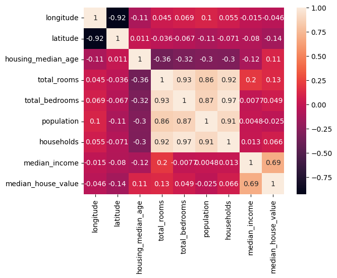
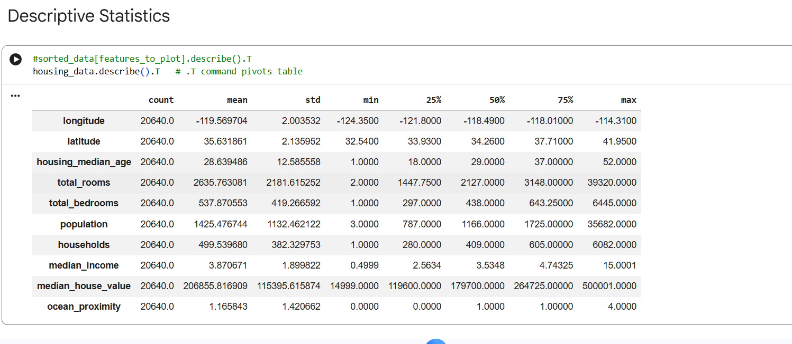
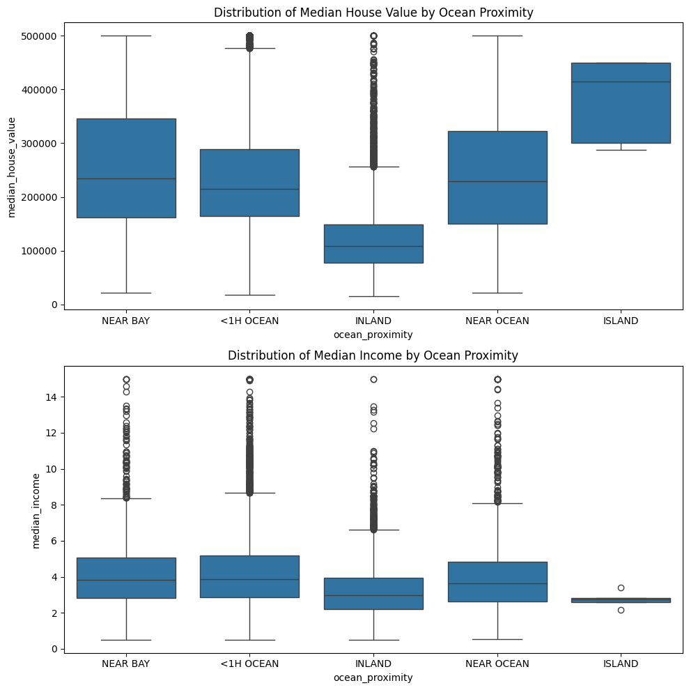
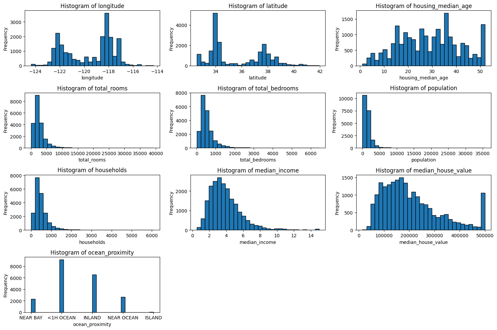
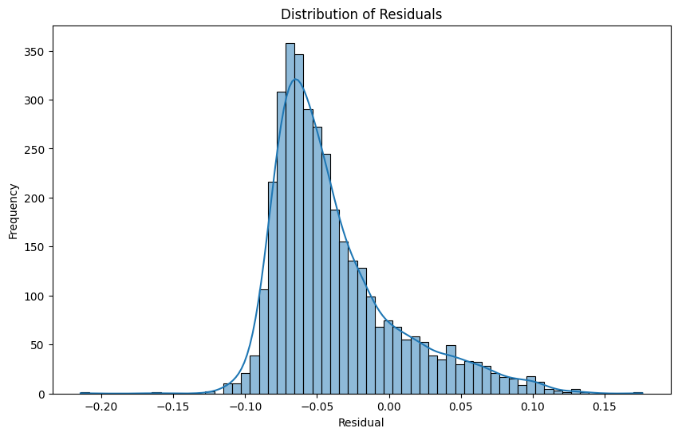

California House Price Prediction

Machine Learning • Support Vector Regression • Data Science

# California House Price Prediction Using Machine Learning and Support Vector Regression


---

## Project Overview

This project develops a machine learning solution to predict California house prices using demographic, socio-economic, and geographical features. A complete machine learning pipeline was implemented, including exploratory data analysis (EDA), data preprocessing, missing value handling, feature engineering, feature scaling, and Support Vector Regression (SVR).

The project evaluates model performance using standard regression metrics such as Mean Absolute Error (MAE), Root Mean Squared Error (RMSE), and residual analysis to assess predictive accuracy and model reliability.

---

## Objectives

- Explore the California Housing dataset
- Perform Exploratory Data Analysis (EDA)
- Handle missing values using KNN imputation
- Engineer and preprocess features
- Train a Support Vector Regression (SVR) model
- Evaluate regression performance
- Analyse residual errors
- Identify factors influencing house prices

---

## Repository Structure

```
California-House-Price-Prediction/
│
├── data/
│   ├── raw/
│   └── processed/
│
├── notebooks/
│   ├── 01_EDA_Preprocessing.ipynb
│   └── 02_Additional_Experiments.ipynb
│
├── reports/
│   └── California_House_Price_Prediction_Report.pdf
│
├── images/
├── results/
├── models/
│
├── requirements.txt
├── README.md
└── LICENSE
```

---
## Machine Learning Workflow

<p align="center">

</p>
## Dataset

The project uses the **California Housing** dataset containing demographic, geographic, and housing-related information collected from California census block groups.

### Features

- Median Income
- Housing Median Age
- Total Rooms
- Total Bedrooms
- Population
- Households
- Latitude
- Longitude
- Ocean Proximity

**Target Variable**

- Median House Value

---

## Technologies Used

- Python
- Pandas
- NumPy
- Scikit-learn
- Matplotlib
- Seaborn
- Jupyter Notebook

---

## Machine Learning Workflow

1. Data Collection
2. Data Cleaning
3. Missing Value Imputation
4. Feature Engineering
5. Feature Scaling
6. Exploratory Data Analysis
7. Model Training (SVR)
8. Model Evaluation
9. Residual Analysis

---

## Model

Support Vector Regression (SVR)

Model configuration includes:

- Linear Kernel
- Feature Scaling
- Hyperparameter tuning
- Train/Test Split (80/20)

---

## Evaluation Metrics

The model was evaluated using:

- Mean Absolute Error (MAE)
- Root Mean Squared Error (RMSE)
- Residual Plot
- Residual Histogram

---


## Results

### Correlation Heatmap

<p align="center">

</p>

### Dataset Statistics

<p align="center">

</p>

### Median House Value Distribution

<p align="center">

</p>

### Feature Histograms

<p align="center">

</p>

### Residual Analysis

<p align="center">

</p>

### Prediction Error

<p align="center">

</p>
---

## Installation

```bash
git clone https://github.com/YOUR_USERNAME/California-House-Price-Prediction.git
```

Install dependencies

```bash
pip install -r requirements.txt
```

---

## Usage

Run the notebooks in the following order:

1. `01_EDA_Preprocessing.ipynb`
2. `02_Additional_Experiments.ipynb`

---

## Future Improvements

- Random Forest Regression
- XGBoost Regression
- LightGBM
- CatBoost
- Deep Neural Networks
- Explainable AI (SHAP)
- Hyperparameter Optimisation
- Model Deployment with Flask/FastAPI

---

## References

- California Housing Dataset
- Scikit-learn Documentation
- Support Vector Regression Documentation

---

## Author

**Sehrush Seemab Awan**

Machine Learning | Data Science | Artificial Intelligence

---

## License

This project is licensed under the MIT License.
